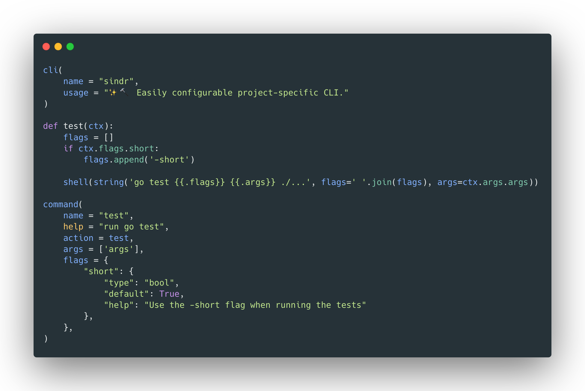

<h1 align=center><code>🔨✨ sindr</code></h1>

[](https://github.com/mbark/sindr/actions/workflows/lint.yml)

`sindr` is a simple way to create a CLI to save and run project-specific commands.

Using [Starlark](https://github.com/bazelbuild/starlark), a Python-subset, you can create a CLI with flags, arguments
and autocompletion to save and run project-specific commands.



Configure your CLI in `Starlark`, using builtin functions like `command` and `shell` to easily create a CLI for your
project. Then run `sindr` to get a CLI for your project-specific commands.

```
sindr test -- -race
test
  Flags  
    short: true    
  Named arguments  
    args: '-race'    
$ go test -short -race ./...
[...]
```

`sindr` has several useful features:

- `sindr` generates a fully-fledged CLI giving your developers a familiar interface for how to run scripts.
- `Starlark` is a Python-subset which makes configuration simple and familiar for developers.
- Building with `go` gives us a single binary with no external dependencies to run.
- Error messages are clear and if relevant, point to the exact line and column in `Starlark`.
- `sindr` can be invoked from any subdirectory, not just the one with `sindr.star`.
- `sindr` can load `.env` files, making it easy to populate environment variables.
- allows string-expansion using `golang` templates.
- has a builtin file-based cache system that can be used to check if some command should be run.
- several other builtin functions to do common tasks like checking if any files have been updated.
- allows executing arbitrary languages, like Python or NodeJS.

## Installation

🚧 **TBD** 🚧

## Quick start

Create a file named `sindr.star` in the root of your project.

```starlark
cli(
    name = "cli_name",
    usage = "some usage text"
)

def a_command(ctx):
    res = shell(string('echo "{{.text}}"',text=ctx.flags.text))
    print(res.stdout)

command(
    name = "a_command",
    action = a_command,
    flags = {
        "text": {
            "type": "string",
            "default": "hello from sindr",
            "help": "text to echo"
        },
    },
)
```

Then invoke `sindr`, it will look in the current directory and upwards for a `sindr.star` file.

When invoking `sindr` with no arguments it will by default show the equivalent of running with `--help`.

```console
$ sindr
NAME:
   cli_name - some usage text

USAGE:
   cli_name [global options] [command [command options]]

COMMANDS:
   a_command  
   help, h    Shows a list of commands or help for one command

GLOBAL OPTIONS:
   --verbose            print logs to stdout (default: false)
   --no-cache           ignore stored values in the cache (default: false)
   --with-line-numbers  print logs with Starlark line numbers if possible (default: false)
   --help, -h           show help
```

This will behave exactly as a CLI, meaning to run the command `a_command` just invoke it with that as the argument.

```console
sindr a_command
a_command
  Flags  
    text: 'hello from sindr'    
$ echo "hello from sindr"
  "hello from sindr"  
"hello from sindr"
```

When running a command `sindr` will log the name of the command, with flags and arguments if any are defined. In this
case none are so it will log simply `a_command`.

## Examples

🚧 **TBD** 🚧

## Comparison

🚧 **TBD** 🚧

### Make

🚧 **TBD** 🚧

## Just

🚧 **TBD** 🚧

## package.json

🚧 **TBD** 🚧

## Building your own CLI

🚧 **TBD** 🚧

## Inspiration

- [`make`](https://www.gnu.org/software/make/manual/html_node/index.html) the original.
- [`just`](https://github.com/casey/just) like `make` but explicitly for running commands.
